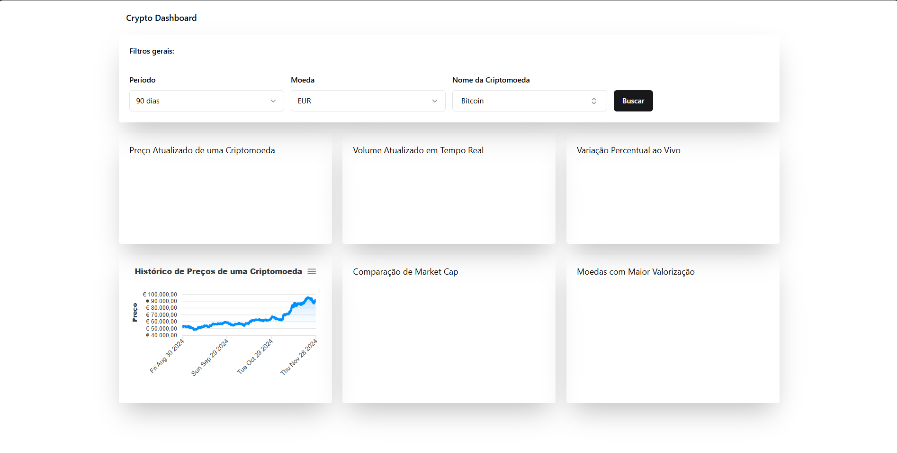

## Como executar

Primeiro, execute o servidor de desenvolvimento:

```bash
npm run dev
# ou
yarn dev
```

É necessário criar um arquivo .env com **VITE_CRYPTO_API_KEY**.

Acesse [http://localhost:5173](http://localhost:5173) no seu navegador para ver o resultado.

## Objetivo

- Desenvolver um dashboard interativo para monitoramento de criptomoedas utilizando a API da CoinGecko,

## Instruções

- Filtros
  - Por Data:○ Intervalo selecionável pelo usuário (últimos 7 dias, 30 dias, 90 dias).
  - Por Moeda de Cotação: Exibir dados em diferentes moedas (USD, EUR, etc.).
  - Por Nome da Criptomoeda: Permitir busca por criptomoedas específicas.

## Requisitos Técnicos

- Tecnologias
  - ReactJS com Typescript.
  - Estilização dos componentes com Tailwind CSS e uso de componentes do shadcn ui.
  - Uso da biblioteca Apexcharts para a criação dos gráficos.
  - Integração com o CoinGecko API com Axios
  - Gerenciamento do estados de formulários com React Hook Form